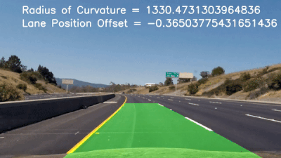

# **Self-Driving Car Engineer - Nanodegree** 
## ---Computer Vision---
# Advanced Lane Line Detection

---
[//]: # (Image References)

[image1]: ./output_images/chess_cornerDraw_undis_12.jpg "Camera Calibration Chessboard"
[image2]: ./output_images/Undistortion_3.jpg "Undistortion of Image 3"
[image3]: ./output_images/Undistortion_5.jpg "Undistortion of Image 5"
[image4]: ./output_images/warp_7.jpg "Perspective Transform of Image 7"
[image5]: ./output_images/warp_2.jpg "Perspective Transform of Image 2"
[image6]: ./output_images/gray_and_thresh.jpg "Gray Image and Binary"
[image7]: ./output_images/RGB_and_thresh.jpg "RGB Channel and Binary"
[image8]: ./output_images/HLS_and_thresh.jpg "HLS Channel and Binary"
[image9]: ./output_images/color_stack_thresh.jpg "Combined Color Images and Binary"
[image10]: ./output_images/sobels_and_magnitude.jpg "Sobelx, Sobely and their magnitude"
[image11]: ./output_images/direction.jpg "Direction of the Gradient"
[image12]: ./output_images/allcombined.jpg "Combined Color and Gradient Thresholding"
[image13]: ./output_images/histogram.jpg "Histogram of Pixels"
[image14]: ./output_images/SlidingWindows.jpg "Sliding Windows"
[image15]: ./output_images/SearchWindow.jpg "Searching Windows"
[image16]: ./output_images/OriginalwithLaneArea.jpg "Warp back onto original image"
[image17]: ./output_images/ResultImageText_3.jpg "Result of Image 3 with Text"
[image18]: ./output_images/ResultImageText_5.jpg "Result of Image 5 with Text"
[image19]: ./output_images/Summary_1.jpg "Summary of Image 1"
[image20]: ./output_images/Summary_2.jpg "Summary of Image 2"
[image21]: ./output_images/Summary_3.jpg "Summary of Image 3"
[image22]: ./output_images/Summary_4.jpg "Summary of Image 4"
[image23]: ./output_images/Summary_5.jpg "Summary of Image 5"
[image24]: ./output_images/Summary_6.jpg "Summary of Image 6"
[image25]: ./output_images/Summary_7.jpg "Summary of Image 7"
[image26]: ./output_images/Summary_8.jpg "Summary of Image 8"
[image27]: ./output_images/OriginalForThresh.jpg "Original Image for Thresholding"

## Introduction
The goal of this project is to write a software pipeline to identify the lane boundaries in a video from a front-facing camera on a car. In project one we already implemented a more simple lane line detection pipeline. Here we are using more complex computer vision techniques for processing the images which leads to a better and more robust lane line detection.

This video shows the result of the project.

 

The goals / steps of this project are the following:

1. Compute the camera calibration matrix and distortion coefficients given a set of chessboard images.
2. Apply a distortion correction to raw images.
3. Apply a perspective transform to rectify binary image ("birds-eye view").
4. Use color transforms and gradients to create a thresholded binary image.
5. Detect lane pixels and fit to find the lane boundary.
6. Determine the curvature of the lane and vehicle position with respect to center.
7. Warp the detected lane boundaries back onto the original image.
8. Output visual display of the lane boundaries and numerical estimation of lane curvature and vehicle position.
9. Create a pipeline to executes all the steps above 
10. Summarize all the steps for the test images
11. Discuss the approach, the results and issues of this project

My project includes the following files:

* AdvancedLaneLineDetection.ipynb: Notebook, containing the code 
* result_video.gif: Video, showing the detected lane boundaries
* README.md: Report for summarizing the results
* output_images: Folder, containing all the images in this report 

---
## 1. Camera Calibration
When a camera looks at 3D objecst in the real wold and transforms them into 2D image, the transformation causes distortion in the 2D image. To correct the distortion a chessboard will be used because the undistorted dimensions are known. We can compare the images of a chessboard taken by the camera in diffrent kind of angles and distances with the known dimension of a chessboard and calculate the distortion coefficents by using the OpenCV functions findChessboardCorners() and calibrateCamera() and in the end undistort the images.
The figure below shows one of the calibration chessboard images distort and undistort with drawn corners.
![alt text][image1]

## 2. Distortion Correction
To apply the distortion to the raw images the distortion coefficients which are calculated in the camera calibration will be used. 
The image below shows three of the test images before and after the distortion.
![alt text][image2]
![alt text][image3]

## 3. Persective Transform
A perspective transform maps the points (source points) in a given image to different, desired image points (destination points) with a new perspective. Here we use the perspective transform in a bird’s-eye view that let’s us view a lane from above. This will be useful for calculating the lane curvature later on.

The figures below show the process steps of the perspective transformation. The red marks are showing the source points in the left image and the destination points in the the right and already warped image. 
The first figure shows an image with straight lane lines, which have been used to create the source and destination points. 
![alt text][image4]

The second figure shows an image with curved lane lines with the same source and destination points as above. To check if the perspective transform is done the right way, the curved lane lines should be parallel in the warped presentation, which is the case.
![alt text][image5]

## 4. Thresholding
To detect the lane lines in an image some image processing is helpful to extract the importent imformation.

### 4.1 Color Thresholding
Lane lines sometimes are better to detect when the image is converted to another color space. The most common color spaces are grayscale, RGB and HLS. The next figures will show one image with difficult conditions for lane line finding converted to diffrent color spaces. To take out the lane line information the color spaces will be thresholded so that they in the end give out a binary image. The thresholds were choosen by trail and error.

Here is the original and warped image which will be processed below. The left lane is yellow and the right lane is white. There are some marks om the pavement as well which can be difficult for lane line detection. 

![alt text][image27]

Here is the image in grayscale and thresholded with 180 < image <= 255. 

![alt text][image6]

The next three figures show the image in R-, G- and B-channel and thresholded with 190 < image <= 255. 

![alt text][image7]

The following three figures show the image in H, L- and S-channel and thresholded with 15 < image <= 100 for H, 150 < image <= 255 for L and 100 < image <= 255 for S. 

![alt text][image8]

The images in the figure show that the S channel is doing a robust job of picking up the lines under very different color and contrast conditions, while the other selections look messy. After comparing all the color transform results of all the test images, three channels were discovered which are doing a good job on the following conditions:

* S-Channel: detecting the yellow lane line 
* H-Channel: detecting lanes with shadows 
* B-Channel: detecting the white lane line

In the end, the combination of the three channels above is showing the best results over all conditions. The combined binary of these three color thresholds is shown below.

![alt text][image9] 

### 4.2 Gradient Thresholding
The canny edge detections used in the first project of lane line detections finds all possible edges in an image which is a lot of information. To reduce the amount of information and still keep the important data imformation, the sobel operator of the canny edge detection will be thresholded. For calculating the gradients the combined color binary will be used. The x sobel is doing in most conditions the better job. To have just one threshold for the x and y gradient, the magnitude of the gradients can be used. The magnitude combines the x and y sobels as an absolut value of gradient. The figure below shows the thresholded x and y sobel operator and the magnitude of the gradient.

![alt text][image10]

In case of lane lines we are only interested in edges of a particular orientation. With calculating the direction of the gradient by taking the inverse tangent of the y gradient devided by the x gradient. To sort out the unimportant directions of the gradient the result will be thresholded. The next image shows the thresholded direction of the gradient.

![alt text][image11]

### 4.3 Color and Gradient Thresholding combined 
To find the best thresholding and combination trail and error was used. In the end the final binary is a combination out of:

* S-Channel Threshold
* H-Channel Threshold
* B-Channel Threshold
* Magnitude Threshold

After all thresholding there is a final binary image which will be used to detect the lane lines in the furter steps.

![alt text][image12]

##  5. Finding Lane Lines
Now, after applying calibration, thresholding, and a perspective transform to a road image  we have a binary image where the lane lines stand out clearly.  However, I still need to decide explicitly which pixels are part of the lines and which belong to the left line and which belong to the right line.

I first take a histogram along all the columns in the lower half of the image (figure below) to detect the peaks as starting points of the two lane lines.

![alt text][image13]

With the starting points of the histogram I implemented sliding windows and fit a polynomial to the lanes. This technique is done by searching for the nonzero pixels in every single sliding window area and center the window according to the found nonzero pixels. The image below shows the result of the sliding winwow technique.

![alt text][image14]

Having the information out of the sliding window calculation the searching window technique can be implemented for the next frame of video so I don't need to do a blind search again. Instead I am just going to search in a margin around the previous line position. The result of the searching window technique is shown in the image below.

![alt text][image15]

## 6. Curvature and Center Offset Position
Now I have a thresholded image, where I have estimated which pixels belong to the left and right lane lines, and I have fit a polynomial to those pixel positions. With this information and the conversion of x and y from pixels space to meters, the radius of curvature can be calculated. For this calculation the assumption is made that the camera is mounted at the center of the car, such that the lane center is the midpoint at the bottom of the image between the two lines which are detected. The offset of the lane center from the center of the image (converted from pixels to meters) is the distance from the center of the lane.

## 7. Warp back
Now I need to warp back the lane fit with a polynomial onto the original image. To do that the polynomial line fit will be warped back with the perspective transform using the inverse matrix of the same given source and destination points. The image below shows the result.

![alt text][image16]

## 8. Visual Output
The visual output will show the result of the lane line detection in form of an colored area on the original image. The values of curvature and vehicle position will be shown as well. An example of the output is shown in the images below.

![alt text][image17]

![alt text][image18]

## 9. Pipeline
After I applied a distortion correction, perspective transform and thresholding to the test images I detected the lane boundaries and warped them back onto the original image and also printed the results on this result image. Now, I need to create a pipeline which executes all those steps. In the end I just need to run the pipeline to detect lane lines in a given video and output a new video showing the results.

## 10. Summary
The following figures summarize all the steps from above for every single test image. 

![alt text][image19]
![alt text][image20]
![alt text][image21]
![alt text][image22]
![alt text][image23]
![alt text][image24]
![alt text][image25]
![alt text][image26]

## 11. Discussion
In this project I experienced how delicate the detection of lane line is.The thresholding and combinations can be good in one color and contrast condition but totaly messes up in a diffrent image condition. I feels like there is always room for improvements. I gathered a huge improvement for the lane detection by switching the steps of perspective transform and thresholding. Doing the perspective transform before the thresholding takes out unimportant information of the image in the first place.

With more difficult image conditions like in the challenge videos my lane line detection is not good enough. Further improvements to make my lane line detection more robust could be:
* Tune the thresholds of color and gradient transform
* Combine more thresholds
* Smooth the lane detection by first detect high-confidence measurements and second append them to a list with n past measurements and third take an average over the list to obtain the lane position which we want to draw onto the image
* Reset detected lane measurements which are problematic for some reason with the previous positions from the frame prior or start searching from scratch using a histogram and sliding window, or another method, to re-establish the measurement
* Using deep learning techniques
